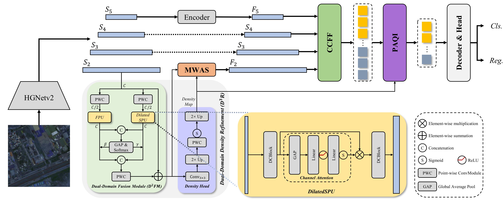

# D3R-DETR: DETR with Dual-Domain Density Refinement for Tiny Object Detection in Aerial Images

> D3R-DETR: DETR with Dual-Domain Density Refinement for Tiny Object Detection in Aerial Images
> 
> [https://arxiv.org/abs/2601.02747](https://arxiv.org/abs/2601.02747)

## Abstract

Detecting tiny objects plays a vital role in remote sensing intelligent interpretation, as these objects often carry critical information for downstream applications. However, due to the extremely limited pixel information and significant variations in object density, mainstream Transformer-based detectors often suffer from slow convergence and inaccurate query-object matching. To address these challenges, we propose D3R-DETR, a novel DETR-based detector with Dual-Domain Density Refinement. By fusing spatial and frequency domain information, our method refines low-level feature maps and utilizes their rich details to predict more accurate object density map, thereby guiding the model to precisely localize tiny objects. Extensive experiments on the AI-TOD-v2 dataset demonstrate that D3R-DETR outperforms existing state-of-the-art detectors for tiny object detection.



## Updates

- 2026/3, our paper has been accepted by IGARSS 2026.
- 2026/1, the code is released.

## Installation

The code is built on [Dome-DETR](https://github.com/RicePasteM/Dome-DETR) with [PyTorch v2.4.0](https://pytorch.org/get-started/previous-versions/), other versions may also work but not tested.

```shell
conda create -n d3rdetr python=3.9
conda activate d3rdetr
pip install -r requirements.txt
```

## Dataset Preparation

Please download the AI-TOD dataset, and prepare the dataset following the [AI-TOD Dataset Preparation](https://github.com/jwwangchn/AI-TOD).

## Train

```shell
bash dist_train.sh
```

## Citation

If you find this repository/work helpful in your research, welcome to cite our paper:

```bibtex
@article{wen2026d3rdetr,
  title={{D$^3$R-DETR: DETR with Dual-Domain Density Refinement for Tiny Object Detection in Aerial Images}},
  author={Wen, Zixiao and Yang, Zhen and Bao, Xianjie and Zhang, Lei and Xiang, Xiantai and Li, Wenshuai and Liu, Yuhan},
  journal={arXiv preprint arXiv:2601.02747},
  year={2026}
}
```
